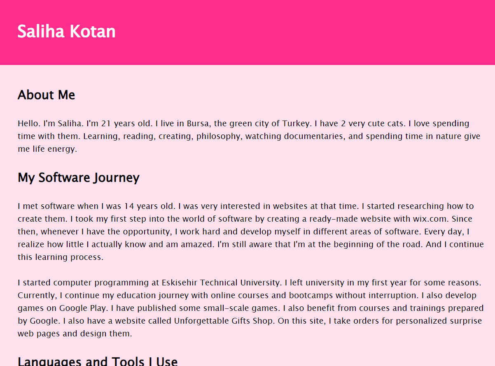
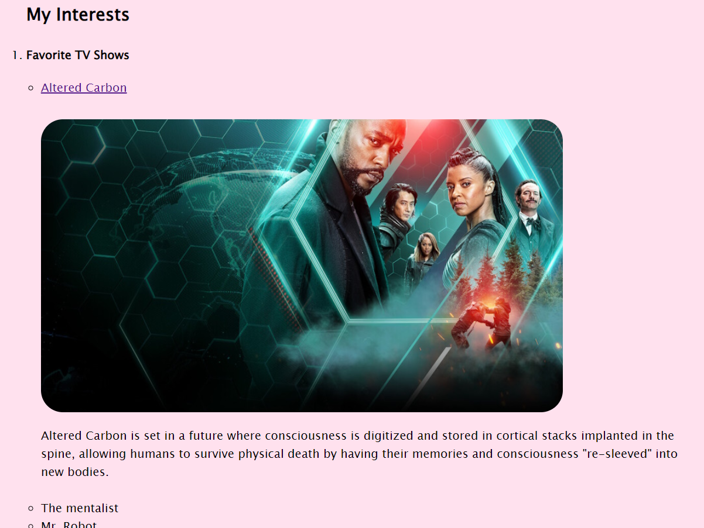
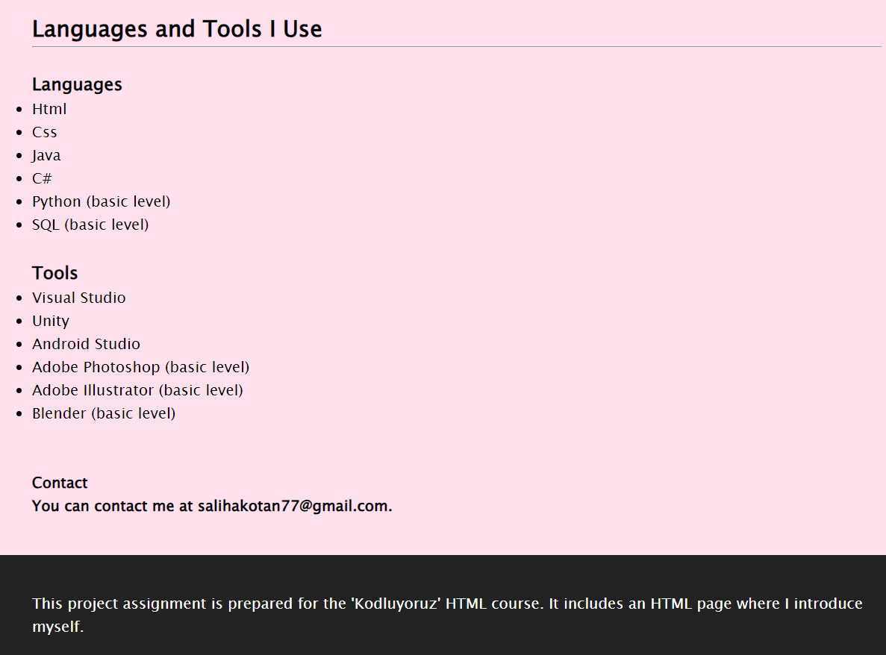
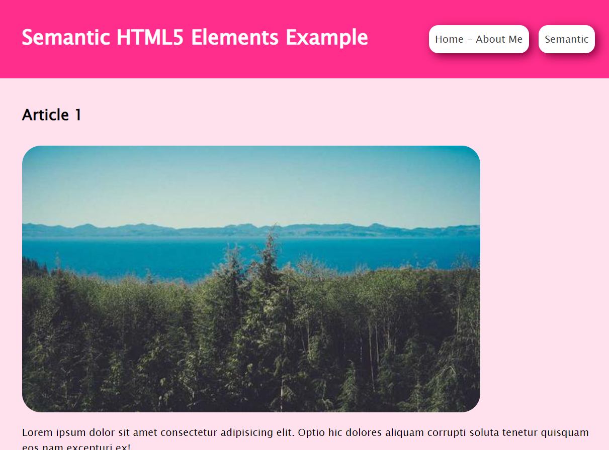
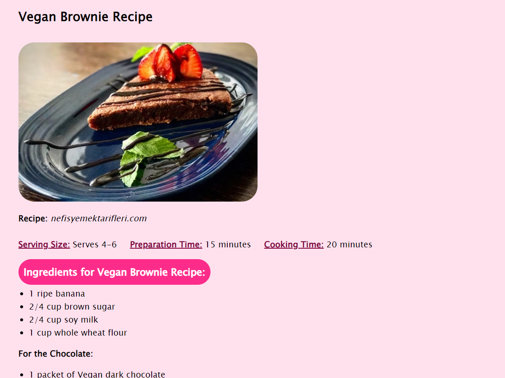

# First Web Page - About Me
This project assignment is prepared for the 'Kodluyoruz' HTML course. It includes three HTML pages: a self-introduction page, a recipe page, and examples of the use of semantic elements.

---

---

---

## Semantic HTML5 Elements

---

---

## Recipe

