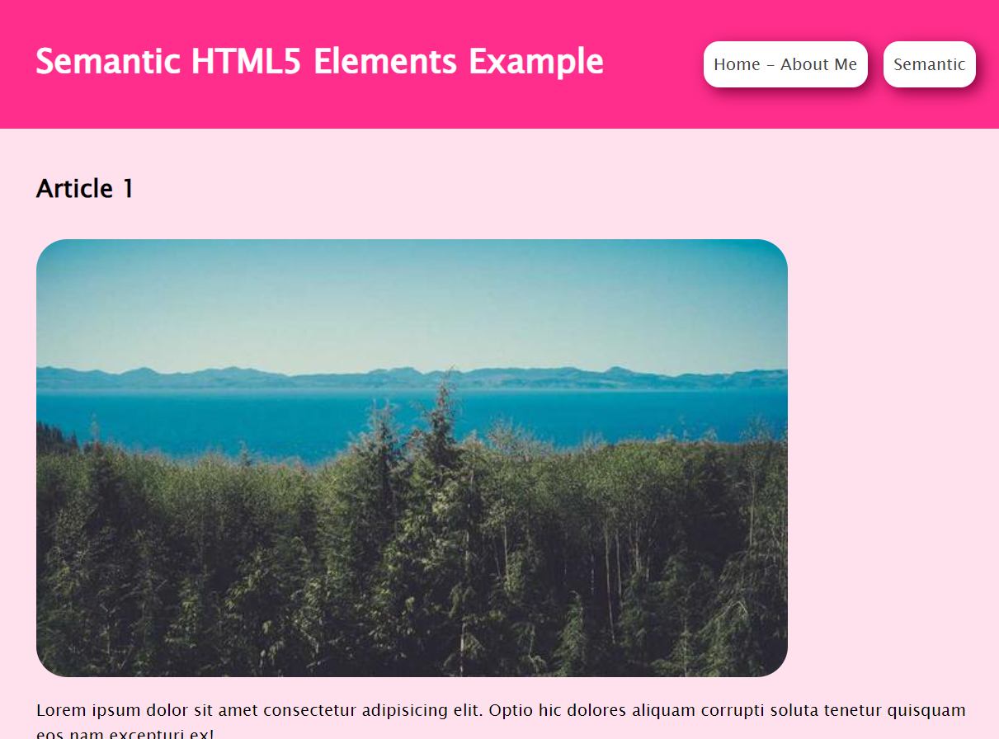

# First Web Page - About Me
This project assignment is prepared for the 'Kodluyoruz' HTML course. It includes two HTML pages, one where I introduce myself and another focusing on the example usage of semantic elements.

---

---

---

## Semantic HTML5 Elements

---

